# Woche 08 - hoho, Projekt: Projekt


## Was ich gelernt habe

- Punkt 1
- Punkt 2
- ...
- Bsp. Global habe ich wie in .... zu sehen..

### Beispielcode

```cpp
// Beispielcode hier einfügen
```

## Was ich debugged habe

- Punkt 1
- Punkt 2
- ...

```cpp
// Debug-Beispiel hier einfügen
```

## Projekt Projekt

### Projektbeschreibung

Lorem .......

### Learnings

-
-

```cpp
// Projekt-Code hier einfügen
```

## Screenshotliste

### Seite 1

**Gehe zu:** [Seite 2](#seite-2) | [Seite 3](#seite-3) | [Seite 4](#seite-4)

- [](screenshots/Screenshot 2025-12-01 013056.png) → [Screenshot 2025-12-01 013056.png](screenshots/Screenshot 2025-12-01 013056.png)
- [](screenshots/Screenshot 2025-12-01 012550.png) → [Screenshot 2025-12-01 012550.png](screenshots/Screenshot 2025-12-01 012550.png)
- [](screenshots/Screenshot 2025-12-01 012322.png) → [Screenshot 2025-12-01 012322.png](screenshots/Screenshot 2025-12-01 012322.png)
- [](screenshots/Screenshot 2025-12-01 005447.png) → [Screenshot 2025-12-01 005447.png](screenshots/Screenshot 2025-12-01 005447.png)
- [](screenshots/Screenshot 2025-11-30 235138.png) → [Screenshot 2025-11-30 235138.png](screenshots/Screenshot 2025-11-30 235138.png)
- [](screenshots/Screenshot 2025-11-30 234348.png) → [Screenshot 2025-11-30 234348.png](screenshots/Screenshot 2025-11-30 234348.png)
- [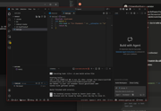](screenshots/Screenshot 2025-11-30 233347.png) → [Screenshot 2025-11-30 233347.png](screenshots/Screenshot 2025-11-30 233347.png)
- [](screenshots/Screenshot 2025-11-30 232153.png) → [Screenshot 2025-11-30 232153.png](screenshots/Screenshot 2025-11-30 232153.png)
- [](screenshots/Screenshot 2025-11-30 152118.png) → [Screenshot 2025-11-30 152118.png](screenshots/Screenshot 2025-11-30 152118.png)
- [](screenshots/Screenshot 2025-11-30 152103.png) → [Screenshot 2025-11-30 152103.png](screenshots/Screenshot 2025-11-30 152103.png)
- [](screenshots/Screenshot 2025-11-30 151929.png) → [Screenshot 2025-11-30 151929.png](screenshots/Screenshot 2025-11-30 151929.png)
- [](screenshots/Screenshot 2025-11-30 151610.png) → [Screenshot 2025-11-30 151610.png](screenshots/Screenshot 2025-11-30 151610.png)
- [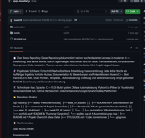](screenshots/Screenshot 2025-11-30 151557.png) → [Screenshot 2025-11-30 151557.png](screenshots/Screenshot 2025-11-30 151557.png)
- [](screenshots/Screenshot 2025-11-30 142245.png) → [Screenshot 2025-11-30 142245.png](screenshots/Screenshot 2025-11-30 142245.png)
- [](screenshots/Screenshot 2025-11-30 142052.png) → [Screenshot 2025-11-30 142052.png](screenshots/Screenshot 2025-11-30 142052.png)
- [](screenshots/Screenshot 2025-11-30 140405.png) → [Screenshot 2025-11-30 140405.png](screenshots/Screenshot 2025-11-30 140405.png)
- [](screenshots/Screenshot 2025-11-30 131809.png) → [Screenshot 2025-11-30 131809.png](screenshots/Screenshot 2025-11-30 131809.png)
- [](screenshots/Screenshot 2025-11-30 131118.png) → [Screenshot 2025-11-30 131118.png](screenshots/Screenshot 2025-11-30 131118.png)
- [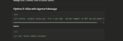](screenshots/Screenshot 2025-11-30 123011.png) → [Screenshot 2025-11-30 123011.png](screenshots/Screenshot 2025-11-30 123011.png)
- [](screenshots/Screenshot 2025-11-30 122841.png) → [Screenshot 2025-11-30 122841.png](screenshots/Screenshot 2025-11-30 122841.png)
- [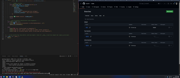](screenshots/Screenshot 2025-11-29 191616.png) → [Screenshot 2025-11-29 191616.png](screenshots/Screenshot 2025-11-29 191616.png)
- [](screenshots/Screenshot 2025-11-29 190847.png) → [Screenshot 2025-11-29 190847.png](screenshots/Screenshot 2025-11-29 190847.png)
- [](screenshots/Screenshot 2025-11-29 175245.png) → [Screenshot 2025-11-29 175245.png](screenshots/Screenshot 2025-11-29 175245.png)
- [](screenshots/Screenshot 2025-11-29 174451.png) → [Screenshot 2025-11-29 174451.png](screenshots/Screenshot 2025-11-29 174451.png)
- [](screenshots/Screenshot 2025-11-29 164207.png) → [Screenshot 2025-11-29 164207.png](screenshots/Screenshot 2025-11-29 164207.png)

### Seite 2

**Gehe zu:** [Seite 1](#seite-1) | [Seite 3](#seite-3) | [Seite 4](#seite-4)

- [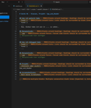](screenshots/Screenshot 2025-11-29 163141.png) → [Screenshot 2025-11-29 163141.png](screenshots/Screenshot 2025-11-29 163141.png)
- [](screenshots/Screenshot 2025-11-29 161618.png) → [Screenshot 2025-11-29 161618.png](screenshots/Screenshot 2025-11-29 161618.png)
- [](screenshots/Screenshot 2025-11-29 150518.png) → [Screenshot 2025-11-29 150518.png](screenshots/Screenshot 2025-11-29 150518.png)
- [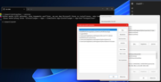](screenshots/Screenshot 2025-11-29 150443.png) → [Screenshot 2025-11-29 150443.png](screenshots/Screenshot 2025-11-29 150443.png)
- [](screenshots/Screenshot 2025-11-29 142337.png) → [Screenshot 2025-11-29 142337.png](screenshots/Screenshot 2025-11-29 142337.png)
- [](screenshots/Screenshot 2025-11-29 124455.png) → [Screenshot 2025-11-29 124455.png](screenshots/Screenshot 2025-11-29 124455.png)
- [](screenshots/Screenshot 2025-11-28 194658.png) → [Screenshot 2025-11-28 194658.png](screenshots/Screenshot 2025-11-28 194658.png)
- [](screenshots/Screenshot 2025-11-26 221745.png) → [Screenshot 2025-11-26 221745.png](screenshots/Screenshot 2025-11-26 221745.png)
- [](screenshots/Screenshot 2025-11-26 221457.png) → [Screenshot 2025-11-26 221457.png](screenshots/Screenshot 2025-11-26 221457.png)
- [](screenshots/Screenshot 2025-11-26 212405.png) → [Screenshot 2025-11-26 212405.png](screenshots/Screenshot 2025-11-26 212405.png)
- [](screenshots/Screenshot 2025-11-26 212053.png) → [Screenshot 2025-11-26 212053.png](screenshots/Screenshot 2025-11-26 212053.png)
- [](screenshots/Screenshot 2025-11-26 212046.png) → [Screenshot 2025-11-26 212046.png](screenshots/Screenshot 2025-11-26 212046.png)
- [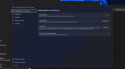](screenshots/Screenshot 2025-11-26 210444.png) → [Screenshot 2025-11-26 210444.png](screenshots/Screenshot 2025-11-26 210444.png)
- [](screenshots/Screenshot 2025-11-26 205940.png) → [Screenshot 2025-11-26 205940.png](screenshots/Screenshot 2025-11-26 205940.png)
- [](screenshots/Screenshot 2025-11-26 205713.png) → [Screenshot 2025-11-26 205713.png](screenshots/Screenshot 2025-11-26 205713.png)
- [](screenshots/Screenshot 2025-11-09 042042.png) → [Screenshot 2025-11-09 042042.png](screenshots/Screenshot 2025-11-09 042042.png)
- [](screenshots/Screenshot 2025-11-09 042022.png) → [Screenshot 2025-11-09 042022.png](screenshots/Screenshot 2025-11-09 042022.png)
- [](screenshots/Screenshot 2025-11-09 041458.png) → [Screenshot 2025-11-09 041458.png](screenshots/Screenshot 2025-11-09 041458.png)
- [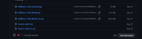](screenshots/Screenshot 2025-11-09 040731.png) → [Screenshot 2025-11-09 040731.png](screenshots/Screenshot 2025-11-09 040731.png)
- [](screenshots/Screenshot 2025-11-09 032639.png) → [Screenshot 2025-11-09 032639.png](screenshots/Screenshot 2025-11-09 032639.png)
- [](screenshots/Screenshot 2025-11-09 032258.png) → [Screenshot 2025-11-09 032258.png](screenshots/Screenshot 2025-11-09 032258.png)
- [](screenshots/Screenshot 2025-11-09 010940.png) → [Screenshot 2025-11-09 010940.png](screenshots/Screenshot 2025-11-09 010940.png)
- [](screenshots/Screenshot 2025-11-09 010635.png) → [Screenshot 2025-11-09 010635.png](screenshots/Screenshot 2025-11-09 010635.png)
- [](screenshots/Screenshot 2025-11-09 010242.png) → [Screenshot 2025-11-09 010242.png](screenshots/Screenshot 2025-11-09 010242.png)
- [](screenshots/Screenshot 2025-11-09 004641.png) → [Screenshot 2025-11-09 004641.png](screenshots/Screenshot 2025-11-09 004641.png)

### Seite 3

**Gehe zu:** [Seite 1](#seite-1) | [Seite 2](#seite-2) | [Seite 4](#seite-4)

- [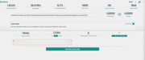](screenshots/Screenshot 2025-11-08 231255.png) → [Screenshot 2025-11-08 231255.png](screenshots/Screenshot 2025-11-08 231255.png)
- [](screenshots/Screenshot 2025-11-08 225224.png) → [Screenshot 2025-11-08 225224.png](screenshots/Screenshot 2025-11-08 225224.png)
- [](screenshots/Screenshot 2025-11-08 225140.png) → [Screenshot 2025-11-08 225140.png](screenshots/Screenshot 2025-11-08 225140.png)
- [](screenshots/Screenshot 2025-11-08 224721.png) → [Screenshot 2025-11-08 224721.png](screenshots/Screenshot 2025-11-08 224721.png)
- [](screenshots/Screenshot 2025-11-08 224559.png) → [Screenshot 2025-11-08 224559.png](screenshots/Screenshot 2025-11-08 224559.png)
- [](screenshots/Screenshot 2025-11-08 224131.png) → [Screenshot 2025-11-08 224131.png](screenshots/Screenshot 2025-11-08 224131.png)
- [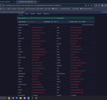](screenshots/Screenshot 2025-11-08 215528.png) → [Screenshot 2025-11-08 215528.png](screenshots/Screenshot 2025-11-08 215528.png)
- [](screenshots/Screenshot 2025-11-08 214537.png) → [Screenshot 2025-11-08 214537.png](screenshots/Screenshot 2025-11-08 214537.png)
- [](screenshots/Screenshot 2025-11-08 214342.png) → [Screenshot 2025-11-08 214342.png](screenshots/Screenshot 2025-11-08 214342.png)
- [](screenshots/Screenshot 2025-11-08 214115.png) → [Screenshot 2025-11-08 214115.png](screenshots/Screenshot 2025-11-08 214115.png)
- [](screenshots/Screenshot 2025-11-08 214018.png) → [Screenshot 2025-11-08 214018.png](screenshots/Screenshot 2025-11-08 214018.png)
- [](screenshots/Screenshot 2025-11-08 213757.png) → [Screenshot 2025-11-08 213757.png](screenshots/Screenshot 2025-11-08 213757.png)
- [](screenshots/Screenshot 2025-11-08 213639.png) → [Screenshot 2025-11-08 213639.png](screenshots/Screenshot 2025-11-08 213639.png)
- [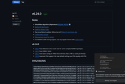](screenshots/Screenshot 2025-11-08 213408.png) → [Screenshot 2025-11-08 213408.png](screenshots/Screenshot 2025-11-08 213408.png)
- [](screenshots/Screenshot 2025-11-08 213401.png) → [Screenshot 2025-11-08 213401.png](screenshots/Screenshot 2025-11-08 213401.png)
- [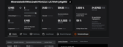](screenshots/Screenshot 2025-11-08 210858.png) → [Screenshot 2025-11-08 210858.png](screenshots/Screenshot 2025-11-08 210858.png)
- [](screenshots/Screenshot 2025-11-08 205647.png) → [Screenshot 2025-11-08 205647.png](screenshots/Screenshot 2025-11-08 205647.png)
- [](screenshots/Screenshot 2025-11-08 203637.png) → [Screenshot 2025-11-08 203637.png](screenshots/Screenshot 2025-11-08 203637.png)
- [](screenshots/Screenshot 2025-11-08 203252.png) → [Screenshot 2025-11-08 203252.png](screenshots/Screenshot 2025-11-08 203252.png)
- [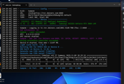](screenshots/Screenshot 2025-11-08 202929.png) → [Screenshot 2025-11-08 202929.png](screenshots/Screenshot 2025-11-08 202929.png)
- [](screenshots/Screenshot 2025-11-08 202847.png) → [Screenshot 2025-11-08 202847.png](screenshots/Screenshot 2025-11-08 202847.png)
- [](screenshots/Screenshot 2025-11-08 190405.png) → [Screenshot 2025-11-08 190405.png](screenshots/Screenshot 2025-11-08 190405.png)
- [](screenshots/Screenshot 2025-11-08 190322.png) → [Screenshot 2025-11-08 190322.png](screenshots/Screenshot 2025-11-08 190322.png)
- [](screenshots/Screenshot 2025-11-08 185650.png) → [Screenshot 2025-11-08 185650.png](screenshots/Screenshot 2025-11-08 185650.png)
- [](screenshots/Screenshot 2025-11-08 185320.png) → [Screenshot 2025-11-08 185320.png](screenshots/Screenshot 2025-11-08 185320.png)

### Seite 4

**Gehe zu:** [Seite 1](#seite-1) | [Seite 2](#seite-2) | [Seite 3](#seite-3)

- [](screenshots/Screenshot 2025-11-08 184340.png) → [Screenshot 2025-11-08 184340.png](screenshots/Screenshot 2025-11-08 184340.png)
- [](screenshots/Screenshot 2025-11-08 180819.png) → [Screenshot 2025-11-08 180819.png](screenshots/Screenshot 2025-11-08 180819.png)
- [](screenshots/Screenshot 2025-11-08 110912.png) → [Screenshot 2025-11-08 110912.png](screenshots/Screenshot 2025-11-08 110912.png)
- [](screenshots/Screenshot 2025-11-08 105523.png) → [Screenshot 2025-11-08 105523.png](screenshots/Screenshot 2025-11-08 105523.png)
- [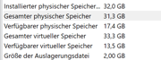](screenshots/Screenshot 2025-11-08 105449.png) → [Screenshot 2025-11-08 105449.png](screenshots/Screenshot 2025-11-08 105449.png)
- [](screenshots/Screenshot 2025-11-08 101408.png) → [Screenshot 2025-11-08 101408.png](screenshots/Screenshot 2025-11-08 101408.png)
- [](screenshots/Screenshot 2025-11-07 235150.png) → [Screenshot 2025-11-07 235150.png](screenshots/Screenshot 2025-11-07 235150.png)
- [](screenshots/Screenshot 2025-11-05 234131.png) → [Screenshot 2025-11-05 234131.png](screenshots/Screenshot 2025-11-05 234131.png)
- [](screenshots/Screenshot 2025-10-18 192310.png) → [Screenshot 2025-10-18 192310.png](screenshots/Screenshot 2025-10-18 192310.png)
- [](screenshots/Screenshot 2025-10-14 164334.png) → [Screenshot 2025-10-14 164334.png](screenshots/Screenshot 2025-10-14 164334.png)
- [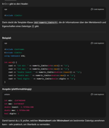](screenshots/Screenshot 2025-10-03 223712.png) → [Screenshot 2025-10-03 223712.png](screenshots/Screenshot 2025-10-03 223712.png)
- [](screenshots/Screenshot 2025-10-03 223522j.png) → [Screenshot 2025-10-03 223522j.png](screenshots/Screenshot 2025-10-03 223522j.png)
- [](screenshots/Screenshot 2025-10-03 223522.png) → [Screenshot 2025-10-03 223522.png](screenshots/Screenshot 2025-10-03 223522.png)
- [](screenshots/Screenshot 2025-10-03 223302.png) → [Screenshot 2025-10-03 223302.png](screenshots/Screenshot 2025-10-03 223302.png)
- [](screenshots/Screenshot 2025-09-29 193526.png) → [Screenshot 2025-09-29 193526.png](screenshots/Screenshot 2025-09-29 193526.png)
- [](screenshots/Screenshot 2025-09-28 174348.png) → [Screenshot 2025-09-28 174348.png](screenshots/Screenshot 2025-09-28 174348.png)
